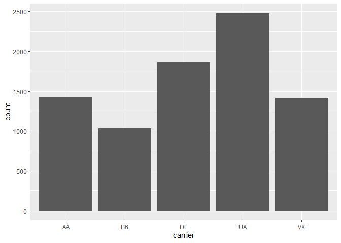

## Install Packages

```r
options(repos = c(CRAN = "http://cran.rstudio.com"))
install.packages("tidyverse")
```

```
## Installing package into 'C:/Users/Rebecca/Documents/R/win-library/3.5'
## (as 'lib' is unspecified)
```

```
## package 'tidyverse' successfully unpacked and MD5 sums checked
## 
## The downloaded binary packages are in
## 	C:\Users\Rebecca\AppData\Local\Temp\RtmpYbnt1W\downloaded_packages
```

```r
install.packages("nycflights13")
```

```
## Installing package into 'C:/Users/Rebecca/Documents/R/win-library/3.5'
## (as 'lib' is unspecified)
```

```
## package 'nycflights13' successfully unpacked and MD5 sums checked
## 
## The downloaded binary packages are in
## 	C:\Users\Rebecca\AppData\Local\Temp\RtmpYbnt1W\downloaded_packages
```

## Working directory

```r
getwd()
```

```
## [1] "C:/Users/Rebecca/Desktop/BIS15-W20-DataScienceBiologists/rebecca"
```

## Session Info

```r
sessionInfo()
```

```
## R version 3.5.1 (2018-07-02)
## Platform: x86_64-w64-mingw32/x64 (64-bit)
## Running under: Windows 10 x64 (build 18362)
## 
## Matrix products: default
## 
## locale:
## [1] LC_COLLATE=English_United States.1252 
## [2] LC_CTYPE=English_United States.1252   
## [3] LC_MONETARY=English_United States.1252
## [4] LC_NUMERIC=C                          
## [5] LC_TIME=English_United States.1252    
## 
## attached base packages:
## [1] stats     graphics  grDevices utils     datasets  methods   base     
## 
## loaded via a namespace (and not attached):
##  [1] compiler_3.5.1  magrittr_1.5    tools_3.5.1     htmltools_0.3.6
##  [5] yaml_2.2.0      Rcpp_1.0.3      stringi_1.1.7   rmarkdown_1.12 
##  [9] knitr_1.22      stringr_1.4.0   xfun_0.6        digest_0.6.18  
## [13] evaluate_0.13
```

## Load the libraries

```r
library(nycflights13)
```

```
## Warning: package 'nycflights13' was built under R version 3.5.3
```

```r
library(tidyverse)
```

```
## Warning: package 'tidyverse' was built under R version 3.5.3
```

```
## -- Attaching packages ---------------------------------------------------------------------------------------------------------------------------------------- tidyverse 1.3.0 --
```

```
## <U+2713> ggplot2 3.2.1     <U+2713> purrr   0.3.3
## <U+2713> tibble  2.1.3     <U+2713> dplyr   0.8.3
## <U+2713> tidyr   1.0.0     <U+2713> stringr 1.4.0
## <U+2713> readr   1.3.1     <U+2713> forcats 0.4.0
```

```
## Warning: package 'ggplot2' was built under R version 3.5.3
```

```
## Warning: package 'tibble' was built under R version 3.5.3
```

```
## Warning: package 'tidyr' was built under R version 3.5.3
```

```
## Warning: package 'readr' was built under R version 3.5.3
```

```
## Warning: package 'purrr' was built under R version 3.5.3
```

```
## Warning: package 'dplyr' was built under R version 3.5.3
```

```
## Warning: package 'stringr' was built under R version 3.5.3
```

```
## Warning: package 'forcats' was built under R version 3.5.3
```

```
## -- Conflicts ------------------------------------------------------------------------------------------------------------------------------------------- tidyverse_conflicts() --
## x dplyr::filter() masks stats::filter()
## x dplyr::lag()    masks stats::lag()
```

## nycflights13

```r
flights
```

```
## # A tibble: 336,776 x 19
##     year month   day dep_time sched_dep_time dep_delay arr_time
##    <int> <int> <int>    <int>          <int>     <dbl>    <int>
##  1  2013     1     1      517            515         2      830
##  2  2013     1     1      533            529         4      850
##  3  2013     1     1      542            540         2      923
##  4  2013     1     1      544            545        -1     1004
##  5  2013     1     1      554            600        -6      812
##  6  2013     1     1      554            558        -4      740
##  7  2013     1     1      555            600        -5      913
##  8  2013     1     1      557            600        -3      709
##  9  2013     1     1      557            600        -3      838
## 10  2013     1     1      558            600        -2      753
## # … with 336,766 more rows, and 12 more variables: sched_arr_time <int>,
## #   arr_delay <dbl>, carrier <chr>, flight <int>, tailnum <chr>,
## #   origin <chr>, dest <chr>, air_time <dbl>, distance <dbl>, hour <dbl>,
## #   minute <dbl>, time_hour <dttm>
```

## Filter
Flights between JFK and SFO airports.

```r
flights %>% 
  filter(origin=="JFK" & dest=="SFO")
```

```
## # A tibble: 8,204 x 19
##     year month   day dep_time sched_dep_time dep_delay arr_time
##    <int> <int> <int>    <int>          <int>     <dbl>    <int>
##  1  2013     1     1      611            600        11      945
##  2  2013     1     1      655            700        -5     1037
##  3  2013     1     1      729            730        -1     1049
##  4  2013     1     1      734            737        -3     1047
##  5  2013     1     1      745            745         0     1135
##  6  2013     1     1      803            800         3     1132
##  7  2013     1     1     1029           1030        -1     1427
##  8  2013     1     1     1031           1030         1     1353
##  9  2013     1     1     1112           1100        12     1440
## 10  2013     1     1     1124           1100        24     1435
## # … with 8,194 more rows, and 12 more variables: sched_arr_time <int>,
## #   arr_delay <dbl>, carrier <chr>, flight <int>, tailnum <chr>,
## #   origin <chr>, dest <chr>, air_time <dbl>, distance <dbl>, hour <dbl>,
## #   minute <dbl>, time_hour <dttm>
```

##Plot
Count of flights between JFK and SFO airports by carrier.

```r
flights %>% 
  filter(origin=="JFK" & dest=="SFO") %>% 
  ggplot(aes(x=carrier))+
  geom_bar()
```

<!-- -->
